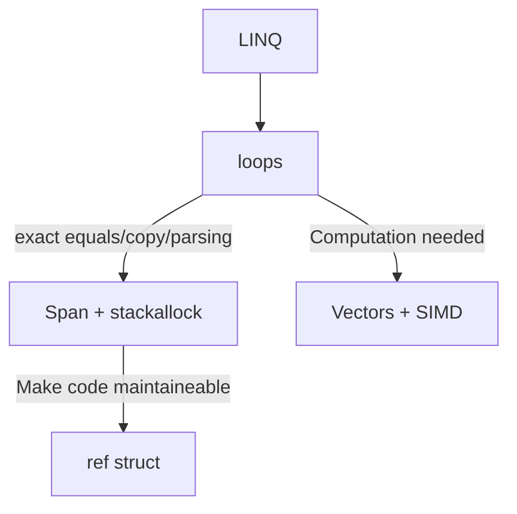

## Optimzing array data processing

```mermaid
flowchart TD
    A[LINQ] --> B[loops]
    B --> |exact equals/copy/parsing| C[Span + stackallock]
    B --> |Computation needed| D[Vectors + SIMD]
    C --> |Make code maintaineable| E[ref struct]
```