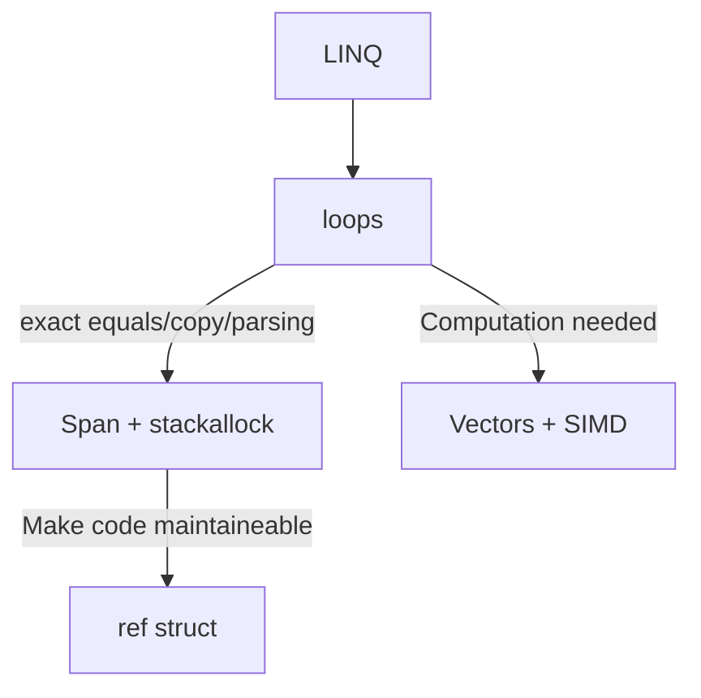
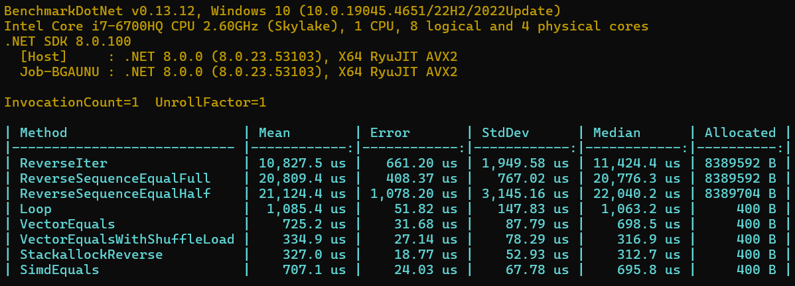
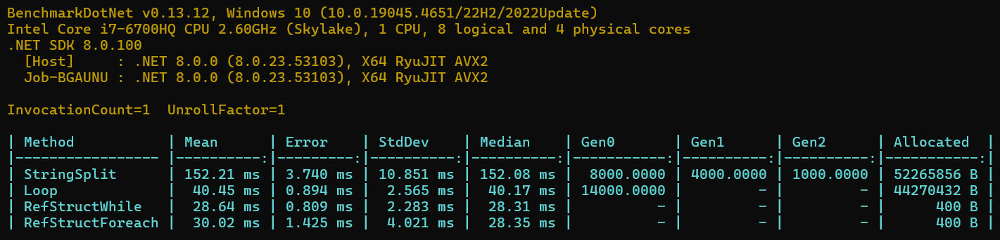
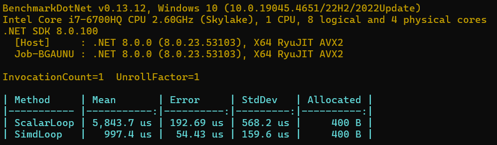
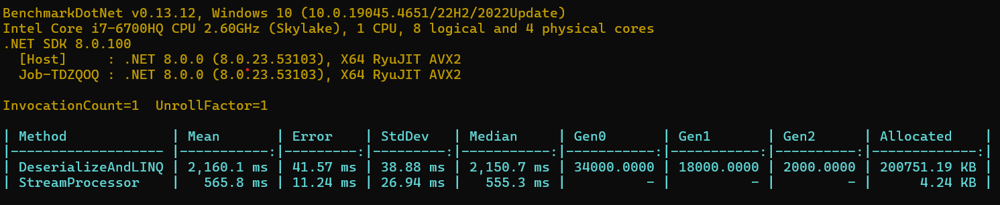

## Optimzing array data processing

## Check string palindrome

## Parse string of ints and sum them

## Compare sensors output (two arrays of int16) and find count of cases where difference >= 10000

## Parse and process JSON stream without disserializing 

